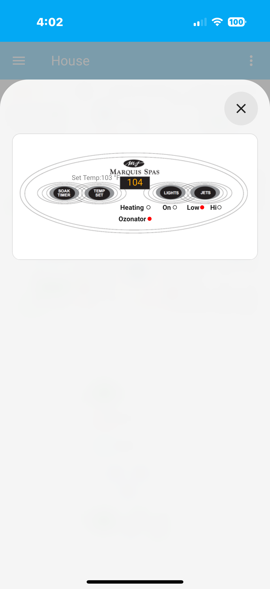
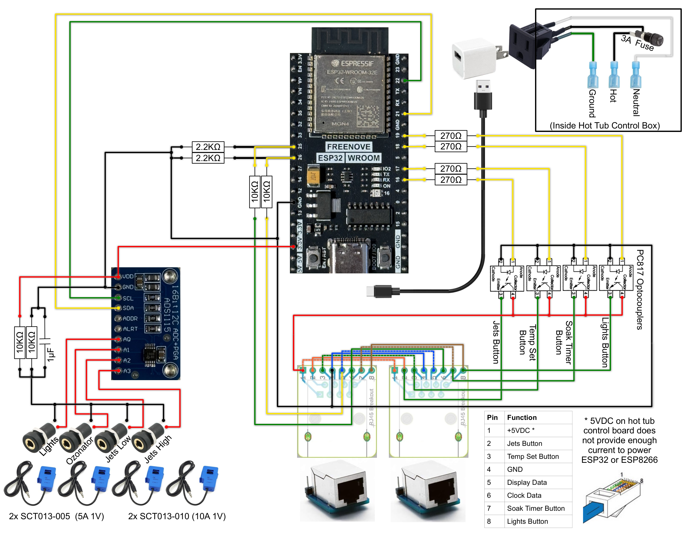

# Marquis Recreational Series Hot Tub Control

ESPHome firmware, a custom display-decoder component, Home Assistant configuration, circuit documentation, and fabrication files for controlling and monitoring a Marquis Recreational Series hot tub with an ESP32.

> [!CAUTION]
> A spa combines lethal **120/240 V AC**, high-current equipment, water, and wet-location wiring. This is an experimental hobby project, not a listed or certified spa controller. Retain all factory safety controls and GFCI protection. Use appropriate isolation, fusing, grounding, strain relief, moisture protection, and enclosures. Disconnect and verify power before opening equipment. Installation should be completed or reviewed by a qualified electrician. You assume all risk.

<p align="center">
  
</p>

## Overview

The project was developed for circa-2000-and-newer Marquis Recreational Series models such as the **Quest RS**, **Destiny RS**, and **Reward RS**. It preserves the original topside panel while adding network visibility and control:

- passively samples the panel clock and data lines;
- decodes the three-character, seven-segment LCD data and heater indicator;
- exposes **Soak Timer**, **Temp Set**, **Lights**, and **Jets** as Home Assistant buttons;
- monitors lights, ozonator, low-speed jets, and high-speed jets with split-core current transformers;
- creates a Home Assistant climate entity and target-temperature workflow; and
- provides example automations and a popup dashboard modeled after the original panel.

This implementation is hardware-specific. Marquis changed hardware over time, so verify connector pinout, logic levels, signal behavior, and button circuitry on your own equipment before connecting it.

## Repository Contents

```text
.
├── ESPHomeComponents/
│   └── marquis_rs_interface_component/
│       ├── hot-tub-control.yaml          # ESP32/ESPHome device configuration
│       ├── secrets.example.yaml          # Safe local-secret template
│       ├── README.md                     # Display protocol/component details
│       └── my_components/
│           └── marquis_rs_interface/     # Custom ESPHome component
├── HomeAssistantComponents/
│   ├── Automation-*.yaml                 # Four supporting automations
│   ├── script.hot_tub_*.txt              # Temperature-adjustment script
│   ├── DashboardExampleConfig.txt        # Example Lovelace view
│   ├── Helpers_Required.txt               # Required helper entities
│   ├── HACs_Components_Required.txt       # Third-party UI/integration list
│   └── files/
│       ├── configuration.yaml            # Climate/template configuration
│       └── www/                           # Dashboard image assets
├── Photos/                                # Build and finished-install images
├── ReverseEngineering/                    # Protocol captures and pinout research
├── CircuitDiagram.png                     # Browser-friendly circuit diagram
├── Circuit_Diagram.pdf                    # Printable circuit diagram
├── Circuit_Diagram.odg                    # Editable circuit source
├── Enclosure-Blank.stl                    # Blank enclosure model
├── HotTubControlEnclosure.stl             # Finished enclosure model
└── Buttons&CTs.txt                         # Original controls and CT notes
```

## Hardware

### Principal Components

| Quantity | Component | Purpose |
| ---: | --- | --- |
| 1 | ESP32 development board (`esp32dev`) | ESPHome controller and display decoder |
| 1 | ADS1115 at I²C address `0x48` | Four-channel CT input ADC |
| 2 | SCT-013-005, 5 A : 1 V | Lights and ozonator monitoring |
| 2 | SCT-013-010, 10 A : 1 V | Low- and high-speed jet monitoring |
| As required | Optocouplers/transistor stages | Isolated simulation of panel buttons |
| 1 | External USB power supply | Dedicated power for the ESP32/ESP8266 |
| As required | Fuse, connectors, enclosure | Safe permanent installation |

See the [PDF drawing](Circuit_Diagram.pdf), [editable ODG source](Circuit_Diagram.odg), and [original component notes](Buttons%26CTs.txt) before assembly.

<p align="center">
  
</p>

### Microcontroller Power

> [!IMPORTANT]
> The 5 V DC supplied by the hot tub control board does not provide enough current to power an ESP32 or ESP8266. The hot tub controller will reboot continuously if you try to use it to power the microcontroller. This made it necessary to use an external USB power supply.

Use a suitably rated, safety-certified USB supply and preserve the signal reference/isolation arrangement shown in the circuit diagram. Do not increase the load on the spa's 5 V rail in an attempt to eliminate the external supply. Keep the low-voltage USB supply and wiring protected from water, condensation, mains terminals, pumps, and heater conductors.

### ESP32 Pin Assignments

| Pin | Function |
| --- | --- |
| GPIO25 | Topside-display clock input |
| GPIO26 | Topside-display data input |
| GPIO19 | Lights button output |
| GPIO18 | Soak Timer button output |
| GPIO17 | Temp Set button output |
| GPIO16 | Jets button output |
| GPIO21 | ADS1115 SDA |
| GPIO22 | ADS1115 SCL |

Button outputs pulse for 150 ms. ESP32 pins must drive the documented interface circuitry; do **not** connect a GPIO directly to mains or an unverified panel circuit.

### Topside RJ45 Pinout

The reverse-engineering worksheet identifies the eight topside-connector conductors as follows. Confirm orientation and voltage on your own controller before relying on this table.

| RJ45 pin | Signal |
| ---: | --- |
| 1 | +5 V DC |
| 2 | Jets button |
| 3 | Temp Set button |
| 4 | Ground |
| 5 | Display data |
| 6 | Display clock |
| 7 | Soak Timer button |
| 8 | Light button |

### Current Monitoring

| ADS1115 channel | Load | Initial on-threshold | Calibration in supplied YAML |
| --- | --- | ---: | ---: |
| A0 | Lights | 0.75 A | 1 raw → 5 A |
| A1 | Ozonator | 0.05 A | 1 raw → 5 A |
| A2 | Jets low | 2 A | 1 raw → 10 A |
| A3 | Jets high | 2 A | 1 raw → 10 A |

These values describe one installation. Place each CT around **one conductor only**, compare readings with a trusted meter/known load, and tune both `calibrate_linear` and binary-sensor thresholds.

## ESPHome Installation

### 1. Copy the Project

Clone this repository on the host running ESPHome, then enter the component directory:

```bash
git clone https://github.com/amccre/MarquisRS_Control.git
cd MarquisRS_Control/ESPHomeComponents/marquis_rs_interface_component
```

### 2. Create Local Secrets

Copy `secrets.example.yaml` to `secrets.yaml` and replace every placeholder. The resulting file is ignored by Git.

```powershell
Copy-Item secrets.example.yaml secrets.yaml
```

Or on Linux/macOS:

```bash
cp secrets.example.yaml secrets.yaml
```

Required values are `wifi_ssid`, `wifi_password`, `api_encryption_key`, `ota_password`, and `fallback_ap_password`.

Generate a compatible API encryption key with `openssl rand -base64 32`, or let ESPHome generate one. Use unique random values for OTA and fallback access. Credentials formerly present in the local source were deliberately replaced with secret references and should be rotated if still in use.

### 3. Review and Flash

Before applying power, verify board type, GPIO assignments, ADS1115 address, logic levels, electrical isolation, CT channels, calibration, and thresholds.

```bash
esphome config hot-tub-control.yaml
esphome run hot-tub-control.yaml
```

Use USB for the initial flash. Once connected, later updates can use ESPHome OTA.

### 4. Add the Device to Home Assistant

In Home Assistant, open **Settings → Devices & services** and add the discovered ESPHome device. Supply the API encryption key from your local `secrets.yaml` when requested.

Expected entities include:

- `sensor.hot_tub_display` (the entity may initially include the ESPHome device prefix);
- `binary_sensor.hot_tub_control_heating`;
- lights, ozonator, jets-low, and jets-high binary sensors/current sensors; and
- four button entities for Soak Timer, Temp Set, Lights, and Jets.

Entity IDs in the supplied Home Assistant examples assume the names shown above. If Home Assistant generates different IDs, update the examples before enabling them.

## Home Assistant Configuration

The files in [`HomeAssistantComponents`](HomeAssistantComponents/) are examples to merge into an existing Home Assistant installation—not a drop-in replacement for your complete configuration.

### 1. Install Optional Custom Components

The supplied UI/configuration uses the following projects:

- [HACS](https://github.com/hacs/integration), to manage custom integrations;
- [Template Climate](https://github.com/jcwillox/hass-template-climate), required for `climate.hot_tub_thermostat`;
- [Bubble Card](https://github.com/Clooos/Bubble-Card), used for the popup panel;
- [card-mod](https://github.com/thomasloven/lovelace-card-mod), potentially needed for styling; and
- a `custom:text-action-element` card used by the example dashboard (install a compatible text-action element or replace those elements with built-in labels).

Restart Home Assistant after installing custom integrations/frontend resources.

### 2. Create Helpers

Create these helpers under **Settings → Devices & services → Helpers**:

| Entity ID | Type | Minimum | Maximum | Suggested icon |
| --- | --- | ---: | ---: | --- |
| `input_number.hot_tub_target_temperature` | Number | 80 | 104 | `mdi:target` |
| `input_number.hot_tub_set_temperature` | Number | 80 | 104 | `mdi:hot-tub` |
| `input_number.hot_tub_temperature` | Number | 0 | 120 | `mdi:hot-tub` |
| `input_boolean.hot_tub_ignore_sync` | Toggle | — | — | `mdi:pause` |

Use a step of `1` and °F as the unit for the number helpers. Template sensors are created in the next step.

### 3. Merge the Climate and Template Configuration

Merge [`HomeAssistantComponents/files/configuration.yaml`](HomeAssistantComponents/files/configuration.yaml) into your Home Assistant `configuration.yaml`. Do **not** overwrite an existing file wholesale. If you already have `climate:` or `template:` sections, merge entries while preserving valid YAML structure.

The configuration creates `climate.hot_tub_thermostat`, `sensor.hot_tub_temperature`, `sensor.hot_tub_set_temperature`, and `sensor.hot_tub_error_code`.

Run **Developer Tools → YAML → Check configuration**, then restart Home Assistant.

### 4. Add the Script and Automations

Import or recreate the supplied script first:

- [`script.hot_tub_read_adjust_to_target.txt`](HomeAssistantComponents/script.hot_tub_read_adjust_to_target.txt) reads the displayed setpoint and repeatedly presses Temp Set until the requested target is reached.

Then add the four automations:

1. [`Automation-Capture_Blinking_Set-Temp.yaml`](HomeAssistantComponents/Automation-Capture_Blinking_Set-Temp.yaml) captures the blinking setpoint display.
2. [`Automation-Record_LCD_temperature_when_stable.yaml`](HomeAssistantComponents/Automation-Record_LCD_temperature_when_stable.yaml) records stable water-temperature readings.
3. [`Automation-Sync_Set-Temp→Target.yaml`](HomeAssistantComponents/Automation-Sync_Set-Temp%E2%86%92Target.yaml) synchronizes a manually observed setpoint to the target helper.
4. [`Automation-Apply_New_Target_Temp.yaml`](HomeAssistantComponents/Automation-Apply_New_Target_Temp.yaml) invokes the adjustment script after the target changes.

Review every entity ID before enabling these automations. The adjustment script physically issues button presses and assumes the panel wraps through its setpoint range; test it while observing the real panel.

### 5. Install Dashboard Assets and Example

Copy the contents of [`HomeAssistantComponents/files/www`](HomeAssistantComponents/files/www/) to Home Assistant's `/config/www/`. Files there are exposed as `/local/...` URLs after a restart/browser refresh.

Use [`DashboardExampleConfig.txt`](HomeAssistantComponents/DashboardExampleConfig.txt) as a starting point for a raw Lovelace dashboard. It contains installation-specific floor-plan positioning and an `/api/image/serve/...` reference; replace that background with your own image URL or upload the desired panel image to `/config/www/` and use `/local/<filename>`.

## How Display Decoding Works

The custom [`marquis_rs_interface`](ESPHomeComponents/marquis_rs_interface_component/my_components/marquis_rs_interface/) component samples the panel data line on display-clock edges and reconstructs 21-bit frames, sent most-significant bit first.

<p align="center">
  
</p>

### Display Data and Clock Timing

Measurements from the captured installation show:

- data starts **1 µs before** the clock pulse;
- data ends **1 µs after** the clock pulse;
- each data pulse is **12 µs** wide;
- gaps between pulses are **12 µs**;
- gaps between display segments are **19 µs**;
- gaps between complete sequences are approximately **17 ms**; and
- button-control pulses are **150 ms**.

The firmware interrupt is triggered by a rising clock edge and waits approximately **16 µs** before reading the data line. After **21 clocked bits**, the completed frame is queued for decoding. The implementation also treats a gap over **1,000 µs (1 ms)** as a frame boundary; the measured 17 ms inter-sequence gap comfortably exceeds that threshold. These values were measured on this installation and are not a manufacturer-guaranteed protocol specification, so remeasure if another controller revision behaves differently.

```text
Bit:      20 | 19 18 | 17 | 16 | 15 14 | 13 ........ 7 | 6 ......... 0
Meaning:   - | first |  - |heat|   -   | middle digit | final digit
```

- Bits 19–18 indicate a leading `1` or blank.
- Bit 16 is the heater indicator.
- Bits 13–7 and 6–0 hold seven-segment character patterns.
- Three consecutive identical frames are required to reject noise; stable state publication is rate-limited to 100 ms.
- A 16-frame ring buffer transfers captures from the interrupt handler to ESPHome's main loop.

### Seven-Segment Character Decoding

The final 14 frame bits represent two seven-segment characters. Each seven-bit value maps segments `A` through `G`, ordered from most-significant to least-significant bit:

```text
       A
      ---
   F |   | B
      -G-
   E |   | C
      ---
       D

Bit order: A B C D E F G
```

For example, `1111110` lights segments A–F and leaves G off, producing `0`; `0110000` lights B and C, producing `1`; and `1101101` produces `2`. The component contains a lookup table for digits `0`–`9`, a useful subset of letters shown by spa status/error codes, blank (`0000000`), and `?` for an unknown pattern. A leading `1` is encoded separately in frame bits 19–18, allowing the three-character display to represent values such as `102` as well as two-digit temperatures.

See the [component documentation](ESPHomeComponents/marquis_rs_interface_component/README.md) and [`ReverseEngineering`](ReverseEngineering/) folder for protocol details and captures.

## Troubleshooting

### Display is blank, unstable, or shows `???`

- Verify connector pinout and signal voltage with appropriate test equipment.
- Confirm clock, data, and reference connections.
- Use high-impedance taps and appropriate level shifting/buffering.
- Keep low-voltage signal wiring away from motors, relays, and heater wiring.
- Enable debug logging while diagnosing frame capture.

### Current-based state is always on or off

- Inspect the underlying current sensor value.
- Confirm the CT surrounds one conductor, not both line and return.
- Verify ADS1115 channel assignments and CT type.
- Calibrate with a known load, then adjust state thresholds.

### A control button does not work

- Verify the isolation/driver circuit, polarity, and selected panel switch.
- Confirm a 150 ms closure is suitable for the physical panel.
- Never attach a bare GPIO to an unknown-voltage circuit.

### Climate target does not track correctly

- Confirm the display entity contains a numeric value during normal operation.
- Confirm all helper and ESPHome entity IDs match the example YAML.
- Ensure the four automations and adjustment script are enabled.
- Observe the panel while testing to validate blink timing and setpoint wraparound.

## Security

- `secrets.yaml`, ESPHome build state, IDE metadata, and Python caches are ignored.
- The checked-in ESPHome YAML references secrets rather than storing credentials.
- Rotate credentials that were ever embedded in another copy of this project.
- Repository visibility is not a substitute for secret management.

## License

This project is licensed under the [GNU General Public License v3.0 or later](LICENSE) (`GPL-3.0-or-later`). You may use, study, modify, and redistribute the project; if you distribute a modified version, the GPL requires the corresponding source and the same license freedoms to remain available. Marquis and other product names remain trademarks of their respective owners.

## Project Status and Disclaimer

This is a working DIY implementation, not a universal plug-and-play controller. There is no automated hardware-in-the-loop test suite. Calibrate and validate it against your installation, retain all factory protections, and keep manual control available.

This project is not affiliated with, endorsed by, or supported by Marquis Corp. Product names identify compatibility only. All files are supplied **as is**, without warranty. The user assumes all risk of code-compliance issues, warranty impact, property damage, equipment failure, electric shock, fire, injury, or death.